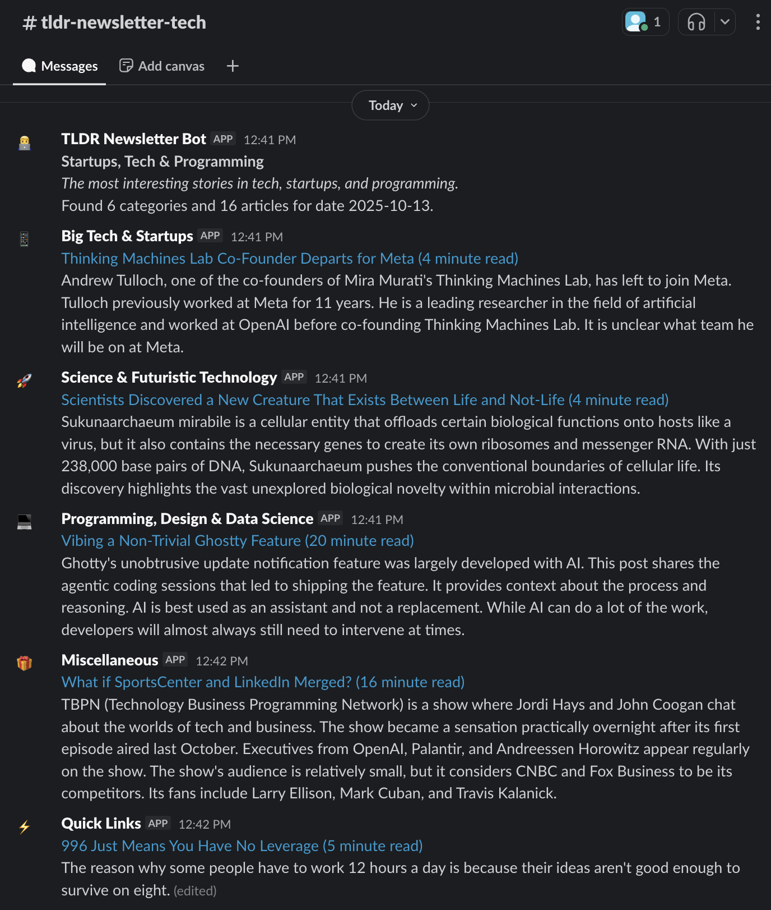

# tldr-newsletter-slack
Route the TLDR Newsletter(s) to Slack because I don't check my email often enough.


### Docker setup

The container can run the API and the daily newsletter schedule itself, so minikube CronJobs are not required.

1. Create a Slack bot and copy its bot token.
2. Create Slack channels matching `#tldr-newsletter-{newsletter}`, for example `#tldr-newsletter-data`.
3. Copy `.env.example` to `.env` and set `SLACK_API_TOKEN`.
4. Start the app:

```
docker compose up -d
```

By default, the container posts `data,tech,devops,product,ai` at `06:00` in `America/Los_Angeles`. Change these env vars to customize it:

| Variable | Default | Purpose |
| --- | --- | --- |
| `TZ` | `America/Los_Angeles` | Container timezone for `SCHEDULE_TIME` |
| `SCHEDULER_ENABLED` | `true` | Enables the built-in daily scheduler |
| `SCHEDULER_RUN_ON_START` | `false` | Posts once when the container starts |
| `SCHEDULE_TIME` | `06:00` | Daily run time in `HH:MM` |
| `NEWSLETTERS` | `data,tech,devops,product,ai` | Comma-separated newsletter list |
| `SLACK_CHANNEL_PREFIX` | `tldr-newsletter-` | Prefix for default Slack channels |
| `ENABLE_DATABASE` | `false` | Enables PostgreSQL cache if you provide `DB_*` vars |
| `DATABASE_URL` | unset | Optional SQLAlchemy URL. Use `sqlite:////data/tldr_cache.db` for a local SQLite cache. |

### Unraid setup

Use `unraid/tldr-newsletter-slack.xml` as the Unraid template. Required values are `SLACK_API_TOKEN`, `TZ`, `SCHEDULE_TIME`, and `NEWSLETTERS`.

To enable a persistent local cache in Unraid, set `ENABLE_DATABASE=true` and keep the template default `DATABASE_URL=sqlite:////data/tldr_cache.db`. The template mounts `/mnt/user/appdata/tldr-newsletter-slack` to `/data`, so the SQLite file persists across container restarts, image updates, and server reboots.

If you prefer external PostgreSQL, remove `DATABASE_URL` and set the `DB_*` variables. The default `DB_HOST=postgres` only works when Docker DNS can resolve a container or service named `postgres`, such as on a shared custom Docker network.

### Kubernetes setup

I run the app via a kubernetes deployment in minikube. I have several cronjobs configured to hit it for each desired newsletter. 

First, create a Slack bot, get the token, and save it as a secret in your cluster:

```
k create secret generic slack-api-token --from-literal=token="my-secret-value"
```

Then, create a Slack channel for your newsletter, in the format of `#tldr-newsletter-{newsletter}`, ie `#tldr-newsletter-data`. You can use a different naming convention and just specify the channel name explicitly with the "channel" parameter.

Lastly, apply the resources with `kubectl apply -f k8s/`. 

### Helpers

Create an ad-hoc run
```
kubectl create job --from=cronjob/tldr-data-post-articles tldr-data-post-articles-manual
```

Interact with the API directly
```
kubectl run mycurlpod --image=curlimages/curl -i --tty -- sh
curl -X GET http://tldr-newsletter-slack:5000/articles?newsletter=data
```

See inside the cache database
```
kubectl port-forward svc/postgres 5432:5432
psql -h localhost -p 5432 -U tldr_user -d tldr_cache
```
